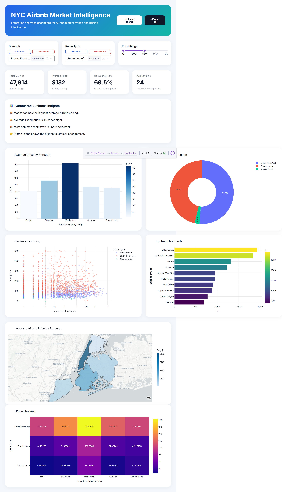
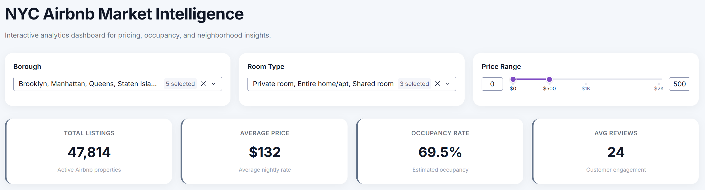
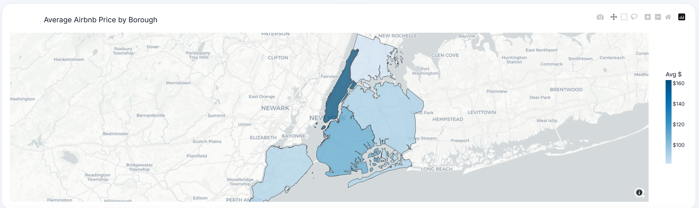
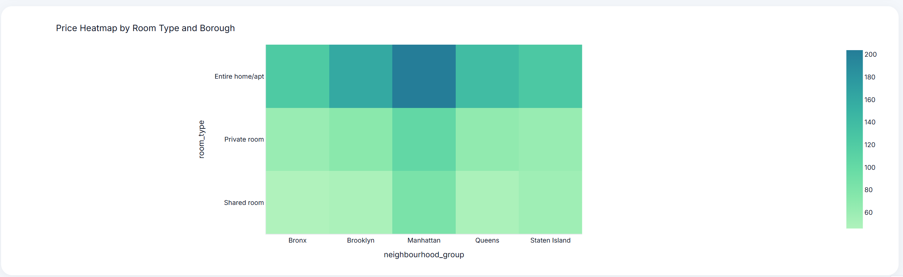

# 🗽 Airbnb NYC Analytics

[](https://www.python.org/)
[](https://pandas.pydata.org/)
[](https://seaborn.pydata.org/)
[](https://plotly.com/)
[](https://dash.plotly.com/)
[](https://jupyter.org/)
[](https://github.com/Haritha-ashok28/airbnb-nyc-analytics)
 
An end-to-end data analytics project exploring New York City's Airbnb market - covering data cleaning, exploratory data analysis, KPI tracking, and interactive dashboard visualization using Python, Plotly, and Dash.
 
---
 
## 📌 Project Overview
 
This project analyzes the NYC Airbnb Open Data to uncover pricing trends, booking patterns, neighborhood performance, and host behavior across New York City's five boroughs. The goal is to surface actionable insights for hosts, travelers, and platform stakeholders through both in-depth analysis and an interactive Dash dashboard.
 
---
 
## 🗂️ Repository Structure
 
```
airbnb-nyc-analytics/
│
├── dataset/              # Raw and cleaned CSV datasets
├── notebooks/            # Jupyter notebooks for EDA, cleaning, and KPI analysis
├── dashboard/            # Dash app source code and assets
├── screenshots/          # Dashboard and visualization screenshots
├── requirements.txt      # Python dependencies
├── .gitignore
└── README.md
```
 
---
 
## 🔍 Key Features
 
- **Data Cleaning** — Handle missing values, outliers, and data type inconsistencies
- **Exploratory Data Analysis (EDA)** — Distribution analysis, correlation heatmaps, and geographic patterns
- **KPI Analysis** — Metrics like average price per borough, occupancy trends, review scores, and listing density
- **Interactive Dashboard** — Filterable, web-based dashboard built with Plotly and Dash
---
 
## 🛠️ Tech Stack
 
| Tool | Purpose |
|------|---------|
| Python | Core analysis and data processing |
| Pandas & NumPy | Data manipulation |
| Matplotlib & Seaborn | Static visualizations |
| Plotly | Interactive charts and graphs |
| Dash | Web-based interactive dashboard |
| Jupyter Notebook | Iterative analysis environment |
 
---
 
## 🚀 Getting Started
 
### Prerequisites
 
- Python 3.8+
- pip
### Installation
 
```bash
# Clone the repository
git clone https://github.com/Haritha-ashok28/airbnb-nyc-analytics.git
cd airbnb-nyc-analytics
 
# Install dependencies
pip install -r requirements.txt
```
 
### Running the Notebooks
 
```bash
jupyter notebook
```
 
Open any notebook in the `notebooks/` folder to explore the analysis.
 
### Running the Dash Dashboard
 
```bash
python dashboard/app.py
```
 
Then visit `http://localhost:8050` in your browser.
 
---
 
## 📊 Key Insights
 
- **Manhattan** commands the highest average nightly prices, while **the Bronx** offers the most affordable options
- **Entire home/apartment** listings dominate in price premium over private and shared rooms
- Listings with higher review counts tend to cluster in tourist-heavy neighborhoods like Midtown and Brooklyn Heights
- Host activity and listing density correlate strongly with proximity to major transit hubs
---
 
## 📸 Screenshots
 
### Dashboard Overview

 
### Filters & KPIs

 
### Map View

 
### Heatmap

 
---
 
## 📁 Dataset
 
The project uses the [NYC Airbnb Open Data](https://www.kaggle.com/datasets/dgomonov/new-york-city-airbnb-open-data) sourced from Kaggle / Inside Airbnb. The dataset includes ~48,000 listings with attributes such as price, location, room type, number of reviews, and availability.
 
---
 
## 📄 License
 
This project is licensed under the [MIT License](./LICENSE).
 
---
 
## 🙋‍♀️ Author
 
**Haritha Ashok**  
[GitHub](https://github.com/Haritha-ashok28)
